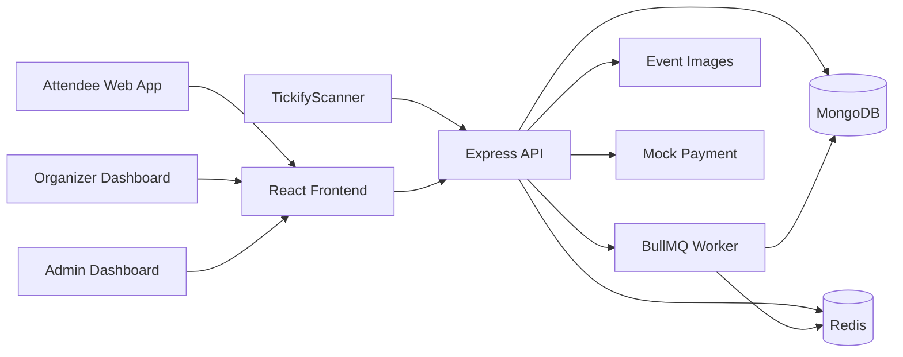
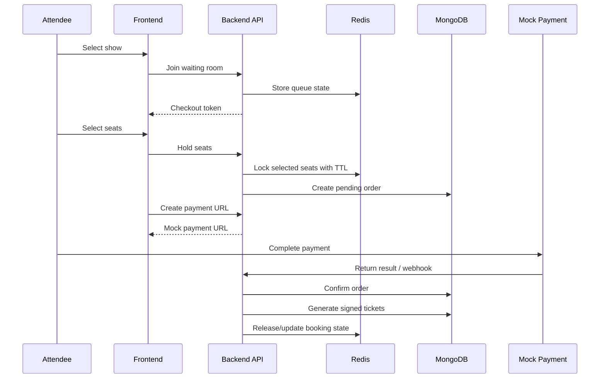

# Tickify

Tickify is a full-stack event ticketing platform for browsing events, booking tickets, issuing QR tickets, and checking attendees in with a mobile scanner app.
Deployed site: https://tickify.tech
The project is built as a small monorepo with three apps:

```txt
backend/          Express + TypeScript API
frontend/         React + Vite web app
TickifyScanner/   Expo React Native scanner app
```

The main focus of Tickify is the ticket booking flow: waiting room, temporary seat holding, mock payment, ticket generation, and QR check-in with offline support.

---

## Features

### Attendee

- Create an account and log in.
- Browse, search, and filter events.
- View event details, shows, ticket types, and seat maps.
- Join a waiting room before booking.
- Select seats or ticket quantities.
- Hold seats temporarily during checkout.
- Complete payment through a mock payment gateway.
- View orders, tickets, and QR codes.

### Organizer

- Register as an organizer and wait for admin verification.
- Create and manage events, shows, venues, ticket types, and seat maps.
- Upload event posters and banners.
- Publish, unpublish, or cancel events and shows.
- Create staff accounts and assign staff to shows.
- Track sales, revenue, seat status, and check-in activity from the dashboard.

### Admin

- View system overview data.
- Manage users.
- Verify organizer accounts.
- Verify venues.

### Staff / Scanner app

- Log in with a staff account.
- View assigned shows.
- Scan ticket QR codes with the device camera.
- Check tickets in online through the backend.
- Validate QR tickets offline using the show's public key, RSA signature, and TOTP code.
- Store offline check-ins locally and sync them when the connection is restored.

---

## Tech Stack

### Backend

- Node.js
- Express.js
- TypeScript
- MongoDB + Mongoose
- Redis
- BullMQ
- JWT authentication with cookie-based sessions
- Multer for event image upload
- Server-Sent Events for realtime dashboard updates
- RSA signature + TOTP for QR ticket validation

### Frontend

- React
- Vite
- TypeScript
- React Router
- TanStack Query
- Axios
- Zustand
- Tailwind CSS
- shadcn-style UI components
- Recharts
- Konva / React Konva for seat map rendering

### Mobile Scanner

- Expo
- React Native
- TypeScript
- Expo Camera
- AsyncStorage
- Expo Secure Store
- React Navigation
- Zustand
- jsrsasign
- OTPAuth

---

## Project Structure

```txt
tickify/
├── backend/
│   ├── src/
│   │   ├── config/          # Database, Redis, auth, TOTP config
│   │   ├── controllers/     # Request handlers
│   │   ├── middleware/      # Auth, role, validation, cache middleware
│   │   ├── models/          # Mongoose models
│   │   ├── queues/          # BullMQ jobs
│   │   ├── routes/          # API routes
│   │   ├── services/        # Business logic
│   │   ├── types/           # TypeScript types
│   │   └── utils/           # Helpers: Redis, crypto, date parsing, seat validation
│   │
│   └── package.json
│
├── frontend/
│   ├── src/
│   │   ├── components/      # Shared UI components
│   │   ├── features/        # Feature modules
│   │   ├── hooks/           # Custom hooks
│   │   ├── lib/             # API client and utilities
│   │   ├── pages/           # App pages
│   │   └── store/           # Zustand stores
│   │
│   └── package.json
│
└── TickifyScanner/
    ├── src/
    │   ├── api/             # Scanner API client
    │   ├── navigation/      # React Navigation setup
    │   ├── screens/         # Mobile screens
    │   ├── stores/          # Scanner state and offline queue
    │   ├── types/           # Scanner types
    │   └── utils/           # QR parsing and offline verification
    │
    └── package.json
```

---

## Architecture



MongoDB stores persistent data such as users, events, shows, venues, seats, orders, payments, tickets, and check-in logs. Redis is used for short-lived booking state: waiting room data, seat locks, zone summaries, cache, and realtime updates.

---

## Booking Flow



The checkout token is used to protect sensitive booking APIs after the waiting room step. Seat locks are temporary, so unpaid orders can expire and release the selected seats back to the show.

---

## QR Ticket Validation

Each show has its own RSA key pair.

When a show is created, the backend generates the RSA key pair automatically. The public key is stored with the show and can be fetched by assigned staff. The private key is encrypted with `ENCRYPTION_MASTER_KEY` and saved as `encrypted_private_key` in the database.

When an order is confirmed, the backend decrypts the show private key and signs the ticket payload. The scanner app can then verify the ticket QR using:

- ticket id
- ticket secret
- TOTP code
- RSA signature
- show public key

This allows the scanner to reject fake QR codes even when the device is temporarily offline. Offline check-ins are stored locally and synced back to the backend later.

---

## Getting Started

### Requirements

- Node.js 18+ or 20+
- npm
- MongoDB local instance or MongoDB Atlas
- Redis local instance or Redis cloud service
- Expo Go, Android Emulator, or iOS Simulator for the scanner app

### Backend

```bash
cd backend
npm install
```

Create `backend/.env`:

```env
PORT=3000
NODE_ENV=development

URI=mongodb://127.0.0.1:27017/tickify

REDIS_URL=redis://127.0.0.1:6379
REDIS_HOST=127.0.0.1
REDIS_PORT=6379
# REDIS_PASSWORD=your_redis_password_if_needed

SECRET_ACCESS_TOKEN=your_access_token_secret
JWT_SECRET=your_checkout_token_secret

FRONTEND_URL=http://localhost:5173
BACKEND_URL=http://localhost:3000
BACKEND_PUBLIC_URL=http://localhost:3000
CORS_ALLOWED_ORIGINS=http://localhost:5173,http://localhost:4173,http://localhost:3000

MOCK_PAYMENT_SECRET=your_mock_payment_secret

# 64-character hex string used to encrypt per-show private keys
ENCRYPTION_MASTER_KEY=0123456789abcdef0123456789abcdef0123456789abcdef0123456789abcdef
```

Start Redis locally with Docker:

```bash
docker run -d --name tickify-redis -p 6379:6379 redis:7-alpine
```

Run the backend:

```bash
npm run dev
```

Backend base URL:

```txt
http://localhost:3000/api/v1
```

Build and run production output:

```bash
npm run build
npm start
```

### Frontend

```bash
cd frontend
npm install
```

Create `frontend/.env`:

```env
VITE_API_URL=http://localhost:3000/api/v1
```

Run the web app:

```bash
npm run dev
```

Frontend URL:

```txt
http://localhost:5173
```

Build and preview:

```bash
npm run build
npm run preview
```

### TickifyScanner

```bash
cd TickifyScanner
npm install
```

Create `TickifyScanner/.env`:

```env
EXPO_PUBLIC_API_URL=http://YOUR_LOCAL_IP:3000/api/v1
```

When running on a physical phone, use the computer's LAN IP instead of `localhost`, for example:

```env
EXPO_PUBLIC_API_URL=http://192.168.1.10:3000/api/v1
```

Run the scanner app:

```bash
npm start
```

Or open it directly on an emulator:

```bash
npm run android
npm run ios
```

---

## Main API Areas

```txt
/auth             Authentication and sessions
/events           Public event listing, search, and details
/shows            Show details, seat map, ticket types, waiting room, stream updates
/waiting-room     Queue status before booking
/orders           Seat holding, order creation, order history
/payments         Mock payment URL and payment result handling
/webhooks         Mock payment webhook handling
/tickets          Ticket detail and QR-related data
/organizer        Organizer events, shows, staff, dashboard, check-in history
/admin            User, organizer, venue, and system management
/staff            Assigned shows, online check-in, public key fetch, offline sync
/venues           Venue management
/zones            Zone management
/seats            Seat management
/ticket-types     Ticket type management
```

---

## Demo Data

The system does not expose public admin registration. To test the full flow from a clean database, create an initial admin account through a seed script or directly in MongoDB, then use that admin account to verify organizer and venue records.

A typical demo flow is:

1. Create or seed an admin account.
2. Register an organizer account.
3. Verify the organizer as admin.
4. Create or verify a venue.
5. Create an event and a show.
6. Configure ticket types and seat map.
7. Publish the event and show.
8. Register an attendee account and book tickets.
9. Create a staff account and assign it to the show.
10. Use TickifyScanner to scan and check in the ticket.

---

## Notes

- Event images are uploaded by the backend and served from the uploads route.
- Redis should be running before starting the backend because booking, waiting room, and dashboard flows depend on it.
- The scanner app needs the backend to be reachable from the phone or emulator.
- Offline check-in is intended for temporary connection loss. The backend still performs the final sync and status update when the scanner reconnects.
