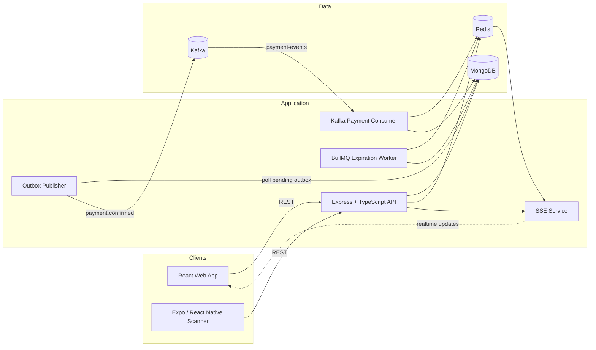
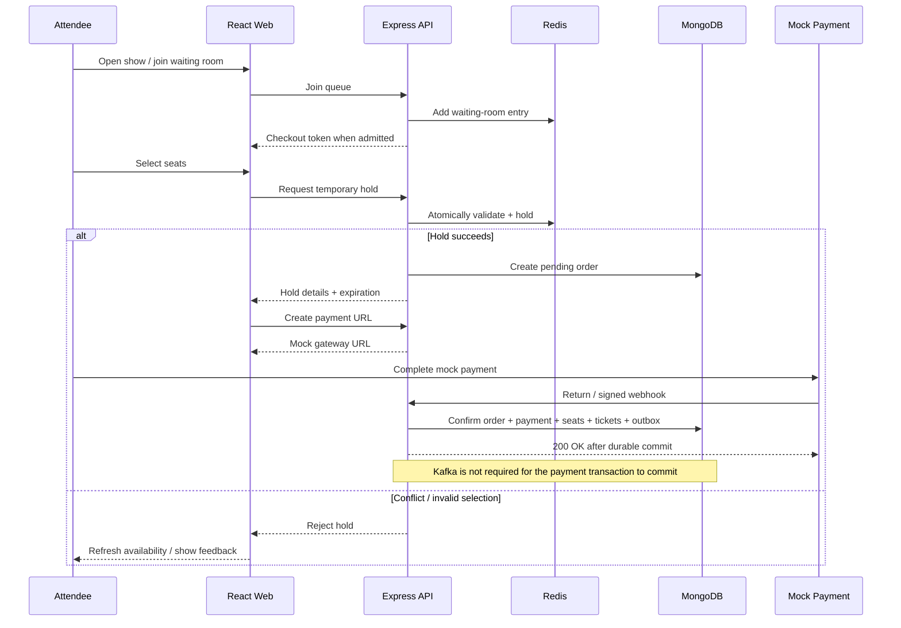
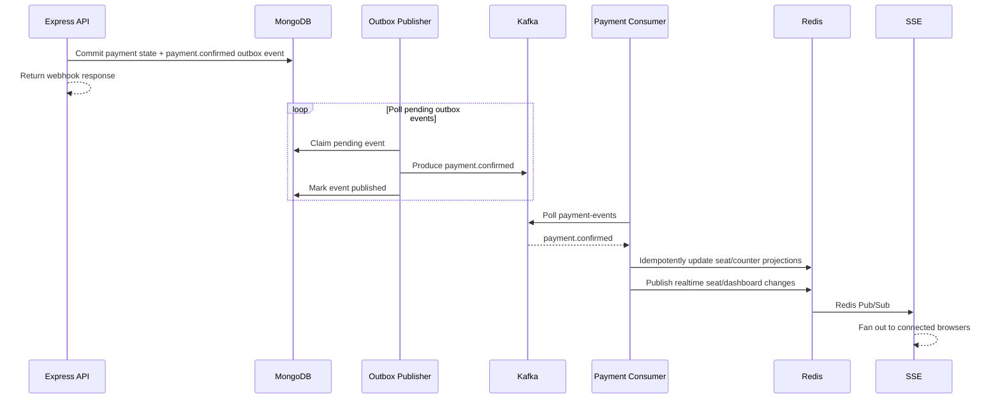

# Tickify 🎟️

**A full-stack event ticketing platform built solo, with real-time seat reservations, waiting-room admission, multi-role web workflows, and a mobile check-in scanner.**

🔗 **Live demo:** [tickify.tech](https://tickify.tech/)

<p align="center">
  <a href="#overview">Overview</a> ·
  <a href="#frontend-engineering">Frontend</a> ·
  <a href="#backend-engineering">Backend</a> ·
  <a href="#mobile-scanner">Scanner</a> ·
  <a href="#architecture">Architecture</a> ·
  <a href="#testing--quality">Testing</a> ·
  <a href="#run-locally">Setup</a>
</p>

---

## Overview

Tickify is a full-stack ticketing project designed around realistic booking workflows rather than only CRUD operations.

The central engineering problem is reservation consistency: **when multiple users try to hold the same seat concurrently, only one reservation should succeed**. The system also has to handle temporary holds, expired checkouts, realtime seat changes, payment callbacks, ticket issuance, and check-in.

The project has three main parts:

- **React web application** — attendee, organizer, and admin workflows.
- **Express / TypeScript API** — booking, authentication, event management, payments, ticketing, realtime updates, and system operations.
- **TickifyScanner** — Expo / React Native app for staff ticket check-in.

---

## Product Preview

| Attendee booking | Organizer dashboard |
| --- | --- |
| ![Interactive seat selection]
 | ![Organizer dashboard]
|
| Interactive seat selection with filters, booking summary, and live availability. | Revenue, ticket, check-in, event, show, and staff workflows. |

| Electronic ticket | Waiting room |
| --- | --- |
| ![Electronic ticket]
| ![Waiting room]
 
|
| Ticket details and QR presentation for check-in. | Queue/admission flow before entering booking. |

---

## Why this project goes beyond CRUD

Tickify focuses on the parts of ticketing that require coordination between frontend state, backend business rules, and short-lived reservation data.

- **Atomic seat holds with Redis Lua** — availability checks and seat-state changes are performed atomically so conflicting hold requests cannot both successfully reserve the same seat. Multi-seat failures trigger rollback of temporary state.
- **Compact row-state representation** — seat rows are represented with `O/H/S/X` states (Open / Held / Sold / Blocked), allowing adjacency and orphan-seat rules to be checked without repeatedly querying individual seat documents.
- **TTL-based reservations + BullMQ expiration** — temporary holds expire after the checkout window; delayed jobs cancel expired pending orders and return inventory to availability.
- **Realtime seat updates** — Redis Pub/Sub distributes seat and zone changes, while Server-Sent Events push those updates to connected browsers without repeatedly polling the full seat map.
- **Waiting-room admission** — a Redis Sorted Set queues users before checkout and issues a short-lived checkout token when they are admitted, reducing pressure on the booking path during high-demand periods.
- **Mock payment workflow** — models payment URLs, HMAC-signed callbacks, webhook/IPN processing, retry behavior, and handling of late or duplicate results without claiming a real financial integration.
- **Transactional outbox + Kafka payment events** — successful payment state and a `payment.confirmed` outbox event are committed in the same MongoDB transaction. A separate publisher forwards pending outbox records to Kafka, and idempotent consumers asynchronously update Redis projections and realtime state without coupling the payment webhook to Kafka availability.
- **Electronic tickets and atomic check-in** — tickets use signed/time-based QR data, and online check-in performs a conditional `VALID → USED` transition to prevent duplicate successful scans.
- **Offline scan-and-sync prototype** — the scanner can persist scan state during temporary connectivity loss and synchronize it after reconnecting. Full production-grade offline verification and multi-device conflict resolution remain future work.

---

## Frontend Engineering

The React application is not only an API display layer. It owns the interaction state and user experience around a time-sensitive booking flow.

### Attendee experience

- Browse, search, and filter published events.
- View event/show details and available ticket types.
- Join the waiting room before booking.
- Select zones, reserved seats, or standing-ticket quantities.
- Filter availability by ticket type and price.
- Track the current selection through a booking sidebar/stepper.
- Receive realtime seat/zone updates through `EventSource`.
- Complete checkout and the mock-payment flow.
- View orders, electronic tickets, and profile data.

### Organizer and admin experience

- Create/update events and shows.
- Upload posters, banners, and SVG seat maps.
- Configure ticket types, pricing, and sale windows.
- Publish, unpublish, or cancel shows.
- Manage check-in staff.
- View revenue, ticket-sale, seat-state, and check-in dashboards.
- Administer users, organizers, and venues.

### Frontend state and UI

- **React Router** for public, authenticated, and role-specific routes.
- **TanStack Query** for server-backed state and mutations.
- **Zustand** for authentication, booking/cart state, and UI feedback state.
- **React Konva / Konva** `StageCanvas` for canvas-based seat/zone rendering, zoom/pan, hover/tap interactions, and interactive seat selection.
- Booking countdowns, loading/skeleton states, success/error feedback, payment-result screens, and empty/error states.
- SSE-driven UI synchronization while users are selecting inventory.

### Interactive seat map

Organizer-uploaded SVG venue layouts are processed into seat/zone geometry, then rendered in the booking UI with **React Konva / Konva**. `StageCanvas` uses canvas primitives such as `Stage`, `Layer`, `Path`, and `Circle` to render venue zones and individual seats, with responsive sizing, zoom/pan behavior, hover/tap interactions, and selection feedback.

This keeps the frontend work visible as a real engineering part of the project rather than making the application look like a thin API client.

The client may show a seat as currently selectable, but the backend remains authoritative about whether that seat can actually be held.

---

## Backend Engineering

The backend is organized into routes, controllers, services, models, middleware, queues, and utilities.

### Persistent vs temporary state

**MongoDB / Mongoose** stores durable business entities such as:

- users and roles,
- events and shows,
- venues, zones, seats, and ticket types,
- orders and payments,
- tickets and check-in logs,
- transactional outbox events used to bridge committed payment state to Kafka.

**Redis** handles temporary or frequently accessed booking state such as:

- static seat-map cache,
- dynamic seat status,
- temporary seat locks,
- row-state strings,
- waiting-room state,
- Pub/Sub events,
- dashboard counters,
- BullMQ queue data.

**Kafka** carries durable backend events that can be processed independently from the payment request path. The current payment flow publishes `payment.confirmed` events from a transactional outbox and consumes them to synchronize downstream Redis projections and realtime updates.

### Payment event pipeline

A successful mock-payment callback first commits the durable business state in MongoDB:

1. Confirm the pending order.
2. Upsert the payment record.
3. Mark purchased seats as sold.
4. Generate tickets.
5. Insert a `payment.confirmed` outbox event in the same transaction.

A separate outbox publisher polls pending events and sends them to the Kafka `payment-events` topic. The payment projection consumer then updates Redis seat state, removes temporary locks and checkout tokens, updates revenue/sold counters, and propagates realtime changes through the existing Redis Pub/Sub + SSE path.

Kafka consumers are treated as at-least-once processors. Counter mutations that cannot safely run twice are guarded by an event-specific Redis deduplication key inside a Lua script so a redelivered Kafka event does not double-count revenue or sold tickets.

### Reservation consistency

The hold/release path uses Redis Lua operations to combine validation and updates into atomic operations.

The booking path can validate:

- whether inventory is still available,
- per-booking ticket limits,
- adjacency/orphan-seat constraints,
- existing temporary locks.

If part of a multi-seat operation fails, rollback logic restores the temporary Redis state instead of leaving a partially completed reservation.

### Seat-map processing

Uploading an SVG seat map can require parsing the layout, creating zone/seat data, and rebuilding Redis cache.

Instead of blocking the create-show request until all of that work finishes, the show can enter a `processing` state while the backend prepares the seat map and later marks it `ready` or `failed`.

### Publish consistency

Publishing a show rebuilds the Redis booking cache after validating the show configuration.

If cache preparation fails, the show is rolled back rather than being opened for sale with incomplete booking state.

### Realtime

Seat and zone changes are distributed through Redis Pub/Sub and exposed to the browser through SSE.

SSE is a good fit here because the important realtime direction is primarily:

```text
server → browser
```

---

## Mobile Scanner

TickifyScanner is an Expo / React Native client for event staff.

The workflow includes:

1. Staff authentication.
2. Viewing assigned shows.
3. Scanning a ticket QR code.
4. Sending online scans to the backend for authorization and ticket validation.
5. Atomically consuming a valid ticket so the same ticket cannot be checked in twice online.
6. Persisting temporary offline scan state and synchronizing it when connectivity returns.

The offline path is treated as a prototype. Production offline ticketing would require stronger local cryptographic verification, pre-event synchronization, and conflict handling across multiple offline devices.

---

## Tech Stack

| Layer | Technologies |
| --- | --- |
| **Frontend** | React, Vite, TypeScript, React Router, TanStack Query, Zustand, Axios, Tailwind CSS, React Konva / Konva |
| **Backend** | Node.js, Express, TypeScript |
| **Persistent data** | MongoDB, Mongoose |
| **Caching / concurrency** | Redis, Lua scripts, TTL locks |
| **Background jobs / events** | BullMQ, Apache Kafka, KafkaJS, transactional outbox |
| **Realtime** | Redis Pub/Sub, Server-Sent Events |
| **Authentication / security** | JWT / HTTP-only cookies, RBAC, bcrypt, HMAC; signed/time-based ticket data |
| **Mobile** | Expo, React Native |
| **Deployment** | Linux, Nginx, PM2, SSL |
| **Testing** | Node.js test runner via `tsx`; unit, integration, and E2E backend test suites |

---

## Architecture


```mermaid
flowchart LR
    subgraph Clients
        WEB[React Web App]
        SCAN[Expo / React Native Scanner]
    end

    subgraph Application
        API[Express + TypeScript API]
        SSE[SSE Service]
        EXPIRY[BullMQ Expiration Worker]
        OUTBOX[Outbox Publisher]
        PAYMENT[Kafka Payment Consumer]
    end

    subgraph Data
        DB[(MongoDB)]
        REDIS[(Redis)]
        KAFKA[(Kafka)]
    end

    WEB -->|REST| API
    SCAN -->|REST| API

    API --> DB
    API --> REDIS
    API --> SSE

    EXPIRY --> REDIS
    EXPIRY --> DB

    OUTBOX -->|poll pending outbox| DB
    OUTBOX -->|payment.confirmed| KAFKA
    KAFKA -->|payment-events| PAYMENT

    PAYMENT --> REDIS
    PAYMENT --> DB

    REDIS --> SSE
    SSE -. realtime updates .-> WEB
```

### Booking flow


```mermaid
sequenceDiagram
    participant U as Attendee
    participant W as React Web
    participant A as Express API
    participant R as Redis
    participant D as MongoDB
    participant P as Mock Payment

    U->>W: Open show / join waiting room
    W->>A: Join queue
    A->>R: Add waiting-room entry
    A-->>W: Checkout token when admitted

    U->>W: Select seats
    W->>A: Request temporary hold
    A->>R: Atomically validate + hold

    alt Hold succeeds
        A->>D: Create pending order
        A-->>W: Hold details + expiration
        W->>A: Create payment URL
        A-->>W: Mock gateway URL
        U->>P: Complete mock payment
        P->>A: Return / signed webhook
        A->>D: Confirm order + payment + seats + tickets + outbox
        A-->>P: 200 OK after durable commit
        Note over A,D: Kafka is not required for the payment transaction to commit
    else Conflict / invalid selection
        A-->>W: Reject hold
        W-->>U: Refresh availability / show feedback
    end
```

### Payment event flow


```mermaid
sequenceDiagram
    participant A as Express API
    participant D as MongoDB
    participant O as Outbox Publisher
    participant K as Kafka
    participant C as Payment Consumer
    participant R as Redis
    participant S as SSE

    A->>D: Commit payment state + payment.confirmed outbox event
    A-->>A: Return webhook response

    loop Poll pending outbox events
        O->>D: Claim pending event
        O->>K: Produce payment.confirmed
        O->>D: Mark event published
    end

    C->>K: Poll payment-events
    K-->>C: payment.confirmed
    C->>R: Idempotently update seat/counter projections
    C->>R: Publish realtime seat/dashboard changes
    R->>S: Redis Pub/Sub
    S-->>S: Fan out to connected browsers
```

---

## Testing & Quality

The current backend exposes separate commands for:

```bash
npm run test:unit
npm run test:integration
npm test
npm run test:coverage
```

The test configuration separates **unit**, **integration**, and **E2E** test suites and runs them serially where shared database/Redis state could otherwise make results nondeterministic.

Testing is intended to protect behavior around business rules and integration boundaries rather than only checking that endpoints return a response.

Kafka/outbox tests should cover the failure modes that motivated the design:

- successful payment creates exactly one durable `payment.confirmed` outbox event,
- duplicate payment callbacks do not create duplicate payments/tickets/events,
- Kafka unavailability does not roll back an already committed payment,
- pending/failed outbox records can be published after Kafka recovers,
- duplicate Kafka delivery does not increment Redis revenue/sold counters twice.


---

## Project Snapshot

The May 2026 academic report measured the project at:

| Component | Files | Lines of code |
| --- | ---: | ---: |
| Backend | 95 TypeScript files | 6,493 |
| Frontend | 110 TypeScript / TSX files | 16,515 |
| TickifyScanner | 12 TypeScript / TSX files | 1,017 |
| **Total** | **217 files** | **23,808** |

At that report snapshot, the backend contained roughly **78 REST endpoints** across 17 route files, 19 controllers, 18 models, and 8 services.

These numbers are included as a snapshot of project scope, not as a measure of code quality.

---

## Status & Roadmap

Tickify is an actively developed portfolio/academic project.

Current boundaries and future improvements include:

- [ ] Integrate a real payment provider such as VNPay / MoMo / ZaloPay with reconciliation and refunds.
- [ ] Add production observability: structured logging, monitoring, alerting, Kafka consumer/outbox lag metrics, and log rotation.
- [ ] Add dead-letter handling and stronger operational tooling for permanently failing Kafka events.
- [ ] Automate deployment after successful checks if a full CD pipeline is desired.
- [ ] Move Redis to a managed service and document degraded-mode/fallback behavior.
- [ ] Add rate limiting, audit logging, refresh-token strategy, and CSRF protection for cookie-based authentication.
- [ ] Complete production-grade offline scanner verification and multi-device sync conflict handling.
- [ ] Add seat-map virtualization / lazy rendering for very large venues.

---

## Run Locally

### Kafka

Start the local Kafka broker from the repository root:

```bash
docker compose -f docker-compose.kafka.yml up -d
```

Configure the backend environment:

```env
KAFKA_BROKERS=localhost:9092
KAFKA_CLIENT_ID=tickify
```

### Backend API

```bash
cd backend
npm install
npm run dev
```

Run the Kafka publisher/consumer worker in a separate terminal:

```bash
cd backend
npm run worker:kafka
```

### Frontend

```bash
cd frontend
npm install
npm run dev
```

### Scanner

```bash
cd TickifyScanner
npm install
npm start
```

MongoDB, Redis, and Kafka must be configured for the backend event pipeline. The API and Kafka worker run as separate processes. When testing the scanner on a physical phone, configure it to reach the backend through the computer's LAN address rather than `localhost`.

For a fuller setup guide, see [`docs/setup.md`](docs/setup.md).

---

## Author

Built solo by **Nguyễn Phước Sang**, Information Technology student at the **University of Information Technology — VNU-HCM**.
